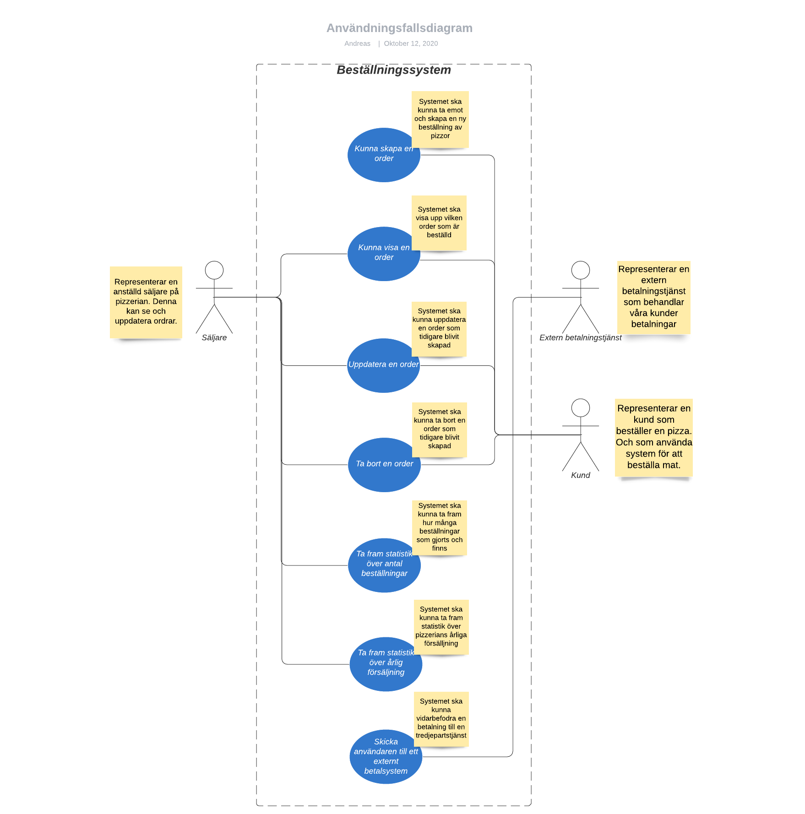
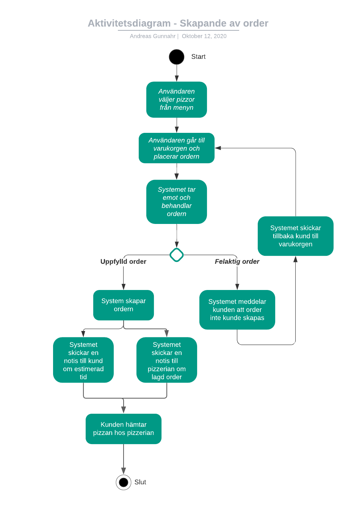
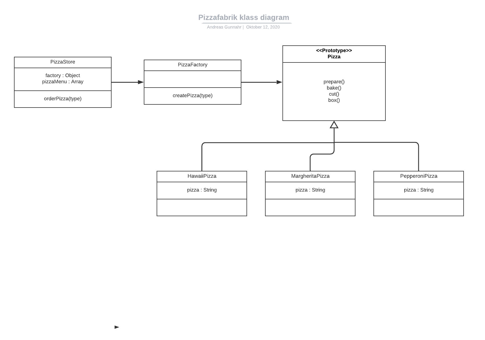

# WEBB19 – OOAD – Individuell Inlämningsuppgift (G-VG)

## Innehållsförteckning

- [WEBB19 – OOAD – Individuell Inlämningsuppgift (G-VG)](#webb19--ooad--individuell-inlämningsuppgift-g-vg)
  - [Innehållsförteckning](#innehållsförteckning)
  - [1. Betygskriterier](#1-betygskriterier)
    - [1.1 Godkänt](#11-godkänt)
    - [1.2 VG](#12-vg)
  - [2. Design mönster](#2-design-mönster)
    - [2.1 Fabriksmönster](#21-fabriksmönster)
      - [2.1.2 Fördelar med mönstret](#212-fördelar-med-mönstret)
      - [2.1.3 Nackdelar med mönstret](#213-nackdelar-med-mönstret)
      - [2.1.4 Summering](#214-summering)
    - [2.2 Konstruktormönstret](#22-konstruktormönstret)
      - [2.2.1 Fördelar med mönstret](#221-fördelar-med-mönstret)
      - [2.2.2 Nackdelar med mönstret](#222-nackdelar-med-mönstret)
      - [2.2.3 Summering](#223-summering)
    - [2.3 Singleton-mönstret](#23-singleton-mönstret)
      - [2.3.2 Fördelar med mönstret](#232-fördelar-med-mönstret)
      - [2.3.3 Nackdelar med mönstret](#233-nackdelar-med-mönstret)
      - [2.3.4 Summering](#234-summering)
  - [3. Dokumentation - Pizzafabrik](#3-dokumentation---pizzafabrik)
  - [4. OOAD - Pizzafabrik](#4-ooad---pizzafabrik)
    - [4.1. Beskrivning](#41-beskrivning)
      - [4.1.1. Slutgiltliga projektmål](#411-slutgiltliga-projektmål)
      - [4.1.2. Begränsningar](#412-begränsningar)
    - [4.2. Kravlista](#42-kravlista)
      - [4.2.1. Funktionella krav](#421-funktionella-krav)
      - [4.2.2. Icke-funktionella krav](#422-icke-funktionella-krav)
    - [4.3. Användningsfallsdiagram](#43-användningsfallsdiagram)
    - [4.4. Aktivitetsdiagram](#44-aktivitetsdiagram)
    - [4.5. Klassdiagram](#45-klassdiagram)

## 1. Betygskriterier

### 1.1 Godkänt

- [x] Välj 3 valfria designmönster från boken ”Learning JavaScript Design Patterns” https://addyosmani.com/resources/essentialjsdesignpatterns/book/
- [x] Du ska beskriva med dina egna ord (på svenska) dina 3 olika designmönster.
- [x] Skapa ett valfritt utvecklingsprojekt (JavaScript-applikation),där du använder minst ett av dina valda designmönster.
- [x] Du behöver dokumentera ditt projekt med dina egna ord och diagram. Modellera några relevanta UML-diagram. Använd lucidchart.com eller ett annat valfritt modelleringsverktyg

### 1.2 VG

- [x] Skriv mer djupgående OOAD utifrån ditt eget utvecklingsprojekt. Analysen ska visa på en god förståelse för projektets mål och användarbehov.
- [x] Du ska visa en god förståelse för skillnaderna mellan dina 3 designmönster samt deras olika tillämpningsmöjligheter i praktisk programmering.

## 2. Design mönster

Ett design mönster är en allmän återanvändbar lösning på ett vanligt förekommande problem inom ett visst sammanhang inom programdesign. Det är inte en färdig design som kan omvandlas direkt till källkod eller maskinkod som vi pratar om. Det är snarare en beskrivning eller mall för hur man löser ett problem som kan användas i många olika situationer. Designmönster är formaliserade bästa praxis/metoder som en programmere kan använda för att lösa vanliga problem vid utformning av ett program eller system.

Har valt att forska kring 3 olika design mönster som jag tycker verkar intressanta från följande [bok](https://addyosmani.com/resources/essentialjsdesignpatterns/book/).
Man hittar alla 10 olika design mönster under kapitlet "Javscript Desgin Patterns".

### 2.1 Fabriksmönster

Det så kallade fabriksmönstret är ett objekt orienterat mönster som går under kategorin skapningsmönster. Fabriksmönstret följer även metodiken DRY ("don't repeat yourself") som på svenska betyder att man inte ska upprepa sig själv. Om man kollar på de andra mönstrena inom kategorin så skiljer sig fabriksmönstret genom att det inte uttryckligen kräver att vi använder en konstruktör. Istället kan en fabrik tillhandahålla ett generiskt gränssnitt för att skapa objekt, där vi kan ange vilken typ av fabriksobjekt vi vill skapa.


#### 2.1.2 Fördelar med mönstret

Fabriksmönstret är väldigt användbart ifall vårt objekt eller komponenter innefattar en hög komplexitet.

Det är också väldigt återanvändbart ifall vi skulle vilja skapa instanser på olika platser i koden. Detta innebär att vi inte behöver upprepa vårt tillstånd, vilket gör att vi inte riskerar att missa ett tillstånd när vi skapar en ny klass.

Sträckbarheten är en annan stor fördel. Ifall någon bestämmer att vi behöver lägga till en ny klass till den här fabriken behöver ingen av samman kopplade koden, varken enhetstester eller implementering, behöva få veta det. Vi skapar helt enkelt en ny klass och utökar vår fabriksmetod. Detta kallas i praktiken för "Open-Closed Principle" på engelska.

En annan stor fördel jag kan se med mönstret är när det kommer till enhetstester. Ifall vi skriver 3 tester för fabriken, för att se till att den returnerar rätt typer under de rätta förhållandena, då behöver våran samtalsklass bara testas för att se om den ringer fabriken och sedan de nödvändiga metoderna på den returnerade klassen. Den behöver inte veta någonting om själva fabriken eller övriga klasser.

#### 2.1.3 Nackdelar med mönstret

Ett fabrikmönster behövs genomtänkas innan det implementeras då det annars kan skapa onödigt stor komplexitet i ens applikation.

Samtidigt som vi sa att enhetstester är en fördel så kan det även vara en nackdel på grund av att processen för att skapa objekt effektivt abstraheras bakom ett gränssnitt, det gör att det också kan ge problem med enhetstester beroende på hur komplex denna process kan vara.

Att ha en fabriksklass för varje objekttyp som du vill skapa kan lägga till komplexitet i din kod och varje objektfamilj kommer att ha en fabriksklass i närheten, så snart kan din kod explodera med fabriksklasser. Vilket i sig kan skapa problem om mönstret inte har tillämpats på en korrekt sätt.

#### 2.1.4 Summering

Tycker att fabriksmönsret är ett väldigt spännande mönster som jag själv inte alltid tänkt på att använda. Då det är väldigt använtbart och ger oss fördelar som att skapa dynamiska objekt som kan bestämas vid körningen av programmet. Det skapar också en bra abstraktion genom att användaren aldrig behöver få tillgång till objektets konstruktör.

Återanvändbarheten är också en stor positivt aspekt då vi kan använda samma fabriker för liknande objekt och det gör att vi enkelt kan lägga till/ta bort nya objektklasser utan att ändra massor av kod. Dock så krävs det att detta mönster implemenetaras på ett korrekt sätt, annars kommer det bara skada vårat projekt avsevärt.

Gjorde mest bara forskning kring den vanliga fabrik mönstret men viktigt att veta att "Abstrakt fabrikmönster" också finns. Detta syftar till att man inkapslar en grupp enskilda fabriker med ett gemensamt mål. Det skiljer detaljerna i implementeringen av en uppsättning objekt från deras allmänna användning.
Denna fabrik bör användas där ett system måste vara oberoende av hur objekten det skapar genereras eller om det behöver arbeta med flera typer av objekt.

### 2.2 Konstruktormönstret

I ett klassiskt objektorienterat programmeringsspråk är en konstruktor en speciell metod som används för att initiera ett nyskapat objekt när minnet har tilldelats det. När det kommer till JavaScript så är vi oftast intresserade av objektkonstruktörer.

Objektkonstruktörer används för att skapa specifika typer av objekt - både förbereda objektet för användning och acceptera argument som en konstruktör kan använda för att ställa in värdena för medlemsegenskaper och metoder när objektet skapas.

Någonting som också är viktigt att poängtera är att det skiljer sig hur man skapar en konstruktor beroende på vilken verision av Javascript man använder sig av.

I den gamla verision ES5 skriver man på följande sätt:

```js
var LoremClass = (function () {
  var Constructor = function (requiredValue, nonRequiredValue = false) {
    this.requiredValue = requiredValue;
    this.nonRequiredValue = nonRequiredValue;
  };
  return Constructor;
})();
```

Medan i den ny verisionen ES6 skriver man:

```js
class LoremClass {
  constructor(requiredValue, nonRequiredValue = false) {
    this.requiredValue = requiredValue;
    this.nonRequiredValue = nonRequiredValue;
  }
}
```

#### 2.2.1 Fördelar med mönstret

En stor fördel jag se kan med mönstret är att vi inkapslar våran kod för konstruktion och representation. Det gör så att vi skyddar bland annat våra objekt från obehörig åtkomst, gör programmet lättare att förstå och minskar männskliga fel. 

Den andra stora fördelen som jag kan se är att vi kan lätt skapa flera instanser av liknande/samma objekt över hela kodbasen.


#### 2.2.2 Nackdelar med mönstret

En nackdel jag kan se med mönstret är att det kan uppkomma onödigt mycket abstraktion av kod. Det vill säga att vi behöver skapa klasser med konstruktörer för funktionalitet som kanske inte nödvändigtvis behöver det. Detta skapar givetvis mera kod, men det finns också en risk att detta introducerar en högre komplexitet i vår applikation. 

#### 2.2.3 Summering

Tycker att konstruktormönstret är ett väldigt nyttigt mönster att kunna då mönstret ger oss mycket struktur och gör det lätt för oss att skapa flera instanser av ett objekt över hela kodbasen så är det ett mönster jag kommer bära med mig i framtiden. Tycker även att inkapsling av kod är någonting som är viktigt och hjälper oss att minska fel som kan enkelt kan uppstå under utvecklingsfasen. 

Samtidigt tror jag att det är viktigt att fundera på ifall mönstret faktiskt är nödvändigt i ens applikation eller inte innan man startar. Annars finns det stor risk att vi istället bara introducera onödig komplexitet till projektet.

Kan dock se mig själv applicera mönstret ifall vi har en applikation som kräver att vi lätt behöver skapa flera instanser av liknande/samma objekt i våran kodbas.


### 2.3 Singleton-mönstret

Singleton-mönstret är ett känt mönster som begränsar instantiering av en klass till ett enda objekt. Klassiskt kan mönstret implementeras genom att skapa en klass med en metod som skapar en ny instans av klassen om den inte finns. Om en förekomst redan existerar returnerar den helt enkelt en referens till det objektet.

Mönstret skiljer sig från statiska klasser (eller objekt) eftersom vi kan fördröja initialiseringen, vanligtvis för att de kräver viss information som kanske inte är tillgänglig under initialiseringstiden.

Någonting som också är viktigt att poängtera är att Singelton inte returnerar ett objekt eller klass utan en struktur. Singelton fungerar genom ett delat resursnamnområde som isolerar implementeringskod från det globala namnområdet för att ge en enda åtkomstpunkt för funktioner.

```js
/* Singleton-objektet implementeras som en omedelbar anonym funktion (eftersom funktionnen saknar namn).
Funktionen körs omedelbart genom att slå in den inom parentes följt av ytterligare två parenteser. */

var Singleton = (function () {
  var instance;

  /* SetInstace-metoden skapar en ny instans av ett objekt och returnerar sedan instans av objektet .*/
  function setInstance() {
    var object = new Object("I am the instance");
    return object;
  }

  return {

    /* GetInstance-metoden är Singletons så kallade portvakt. Den returnerar den unika instansen av objektet
    samtidigt som den bibehåller en privat referens till det som inte är tillgängligt för omvärlden.*/
    getInstance: function () {
      if (!instance) {
        instance = createInstance();
      }
      return instance;
    },
  };
})();

function run() {
  var instance1 = Singleton.getInstance();
  var instance2 = Singleton.getInstance();

  alert("Same instance? " + (instance1 === instance2));
}
```

En viktigt notering när det kommer till våran getInstance-metod är att vi kan se ett annat designmönster som heter Lazy Load. Kortfattat så kontrollerar Lazy Load om en instans redan har skapats; om inte skapar den en och lagrar den för framtida referens. Vilket kommer att innebär att alla efterföljande anropp kommer att få den lagrade instansen.

#### 2.3.2 Fördelar med mönstret

Finns givetvis flera fördelar med mönstret men skulle våga säga att en av de viktigaste fördelarna är att det är resursvänligt. Vilket innebär att man inte slösar minne för ett nytt objekt när man faktiskt inte behöver ett nytt objekt.

En annan stor fördel med Singleto är du är helt säker på antalet instanser när du använder Singleton, och du kan ändra dig och hantera valfritt antal instanser.

#### 2.3.3 Nackdelar med mönstret

Två nackdelar med Singleton är framför allt att det försvårar enhetstestning och att det skapar dolda beroenden.

Försvåringen av enhetstestningen kan uppstå för att en Singleton kan orsaka svårigheter i att skriva testbar kod om objektet och metoderna som är associerade med det är så tätt kopplade att det blir omöjligt att testa utan att skriva en helt funktionell klass.

Dolda beroenden kan uppstå eftersom Singleton är tillgängligt i hela kodbasen, vilket kan bidra till att den kan överanvändas. Eftersom dess referens inte är helt transparent när den går vidare till olika metoder blir det svårt att spåra.

#### 2.3.4 Summering

Tycker att Singleton var ett av de tråkigare mönstrena att undersöka men samtidigt tycker jag det är ett oerhört viktigt mönster/koncept att ha koll på. Singleton mönstret bidrar till att koden blir mera resursvänlig och bidrar till att vi endast skapar ett nytt objekt ifall objektet redan inte finns. 

Viktigt att poängtera är även att dolda beroende kan uppstå ifall mönstret inte implementeras på ett bra sätt. Detta uppstår ofta genom att mönstret överanvänds över hela kodbasen. 

Detta mönster används också inom många andra mönster som t.ex. Abstrakt fabrikmönstret, prototyp mönstret, fasad mönstret m.m. 

## 3. Dokumentation - Pizzafabrik

Valde att skapa en pizzeria som applikation som bygger på fabriksmönstret och konstruktormönstret. Applikationen använder sig utav en pizzafabrik där vi ombeds att skapa en ny pizza. I stället för att då skapa den här pizzan direkt med den nya operatören eller via en annan skapande konstruktör ber vi istället vårt fabriksobjekt om en ny pizza. Det vill säga vi informerar fabriken om vilken typ av objekt som krävs (t.ex. "hawaii", "pepperoni") och den omedelbart skapar en nytt pizza objekt vi kan använda. 

Applikation bygger också på att varje enskild pizza klass förlängs på basklassen "Pizza" som innehåller alla metoder som en gemensamma för varje pizza. Dessa metoder är baka, tillaga, skära och paketera. 

Tyckte att uppgiften var givande och rolig att implementera då man fick en bra förståelse för hur dessa två mönster fungerar ihop. Mönstrena i sig tyckte jag inte var speciellt svåra att jobba med, men kan samtidigt känna att det skulle kräva mycket mera planering ifall man skulle applicera dem i ett större projekt. 

Applikationen kan ses i filen [PizzaFactory.js](https://github.com/AndreasGunnahr/WEBB19-OOAD-Individuell/blob/master/PizzaFactory.js). Filen är körbar som konsolapplikation och visar hur de två ovan nämnde mönstrena fungerar i praktiken.

## 4. OOAD - Pizzafabrik

OOAD är en förkorttning för objektorienterad analys och design. Man brukar säga att OOAD är en systematisk metod för att gå från problembeskrivning till färdigt system. Metoden är väldigt populär när det kommer till att analysera och desgina en appliktion inom olika objektorienterad programmeringsspråk.

### 4.1. Beskrivning

Företaget Pizzeria Arboga är en lokal pizzeria där kunder kan beställa olika typer av pizzor. Eftersom majoriten av företagets kunder är lokala så önskar man att systemet först innefattar svenska och ifall tid finns så lägger man till engelska. Då största delen av kundbasen är av den yngre generation så har efterfrågan på att kunna beställa pizza online vuxit. Då budgeten är ganska låg så kan de inte använda tredjepartstjänster och istället vill man investera på långsikt i ett eget beställningssystem som först och främst är anpassat till en mobil. De vill kunna på ett lättare och effektivare sätt hantera ordrar för att i slutändan behålla redan befintliga kunder men också skaffa nya. I dagsläget lägger en person för mycket tid på att ta emot ordrar via telefon, vilket tar mycket tid ifrån andra arbetsuppgifter. Man hoppas däför på att kunna få till ett så enkelt och smiddigt beställningsystem som möjligt för att minska tiden i telefon för de anställda. Man vill även kunna få statistik kring hur många beställningar man fått in på en månad och hur deras årliga försäljning sett ut.

#### 4.1.1. Slutgiltliga projektmål

Utifrån beskrivning har jag tagit fram några slutgiltliga projektmål:

- Ett beställningssystem som kan skapa- och visa upp en order.
- Inga tredjepartstjänster (som kostar pengar).
- Bibehålla- och attrahera nya kunder.
- Minska telefontiden för anställda.

#### 4.1.2. Begränsningar

Utifrån beskrivning har jag tagit fram några olika begränsningar:

- Då kunden har begränsad budget så kommer jag bara implementera svenska som språk.
- Då kunden har begränsad budget så väljer jag att först och främst fokusera på en mobilanpassad webbtjänst.
- Då kunden har begränsad budget så kommer vi inte implementera ett betalningssystem från start.

### 4.2. Kravlista

Funktionella krav beskriver funktionaliteten hos den beställda produkten, tjänsten eller systemet. Exempel på formulering av ett funktionellt krav skulle kunna vara: ”en kund som bokar en evenemangsbiljett via webbportalen ska få ett mail som bekräftelse på sin bokning”.

Icke-funktionella krav beskriver egenskap inte en funktion utan en egenskap som en produkt eller tjänst har. Exempel på ett icke-funktionellt krav skulle kunna vara: “systemet ska ha en upptid på 99,99%”.

#### 4.2.1. Funktionella krav

| **Beskrivning på krav**            | **Prioriteringsgrad(Låg/Medel/Hög)** |
| ---------------------------------- | ------------------------------------ |
| Kunna skapa en order               | Hög                                  |
| Kunna visa en order                | Hög                                  |
| Kunna updatera en order            | Hög                                  |
| Kunna ta bort en order             | Hög                                  |
| Betalsystem                        | Låg                                  |
| Statistik över antal beställningar | Medel                                |
| Statistik över årlig försäljning   | Låg                                  |
| Språkinställningar                 | Medel                                |

#### 4.2.2. Icke-funktionella krav

| **Beskrivning på krav**                                                                | **Prioriteringsgrad(Låg/Medel/Hög)** |
| -------------------------------------------------------------------------------------- | ------------------------------------ |
| Det ska finnas responsive desgin                                                       | Låg                                  |
| Det ska finnas en betallösning                                                         | Låg                                  |
| Det ska finnas möjlighet att bygga ut systemet om behovet uppstår vid senare tillfälle | Hög                                  |

### 4.3. Användningsfallsdiagram




### 4.4. Aktivitetsdiagram



### 4.5. Klassdiagram



